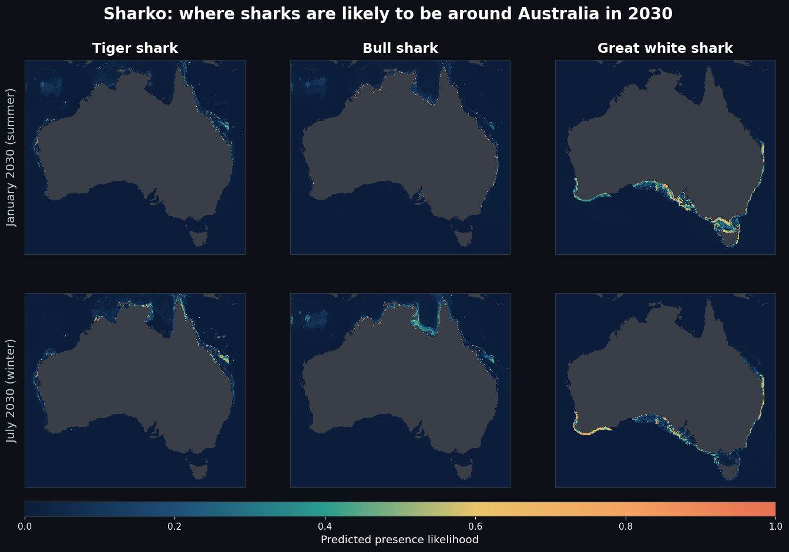
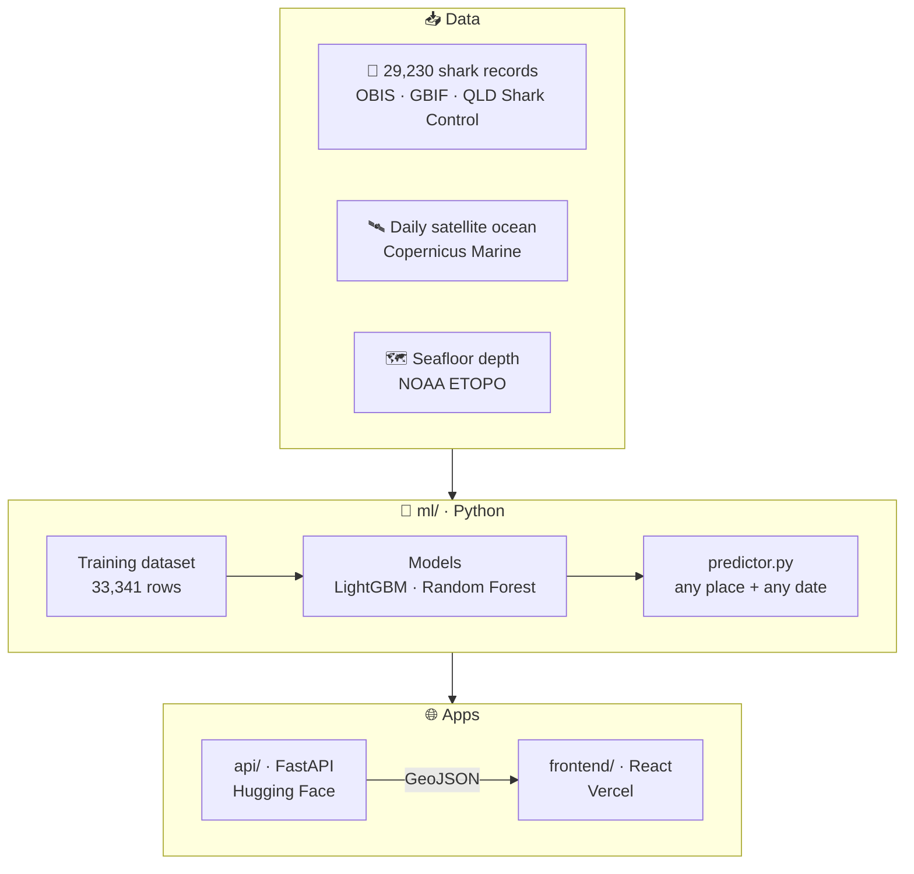
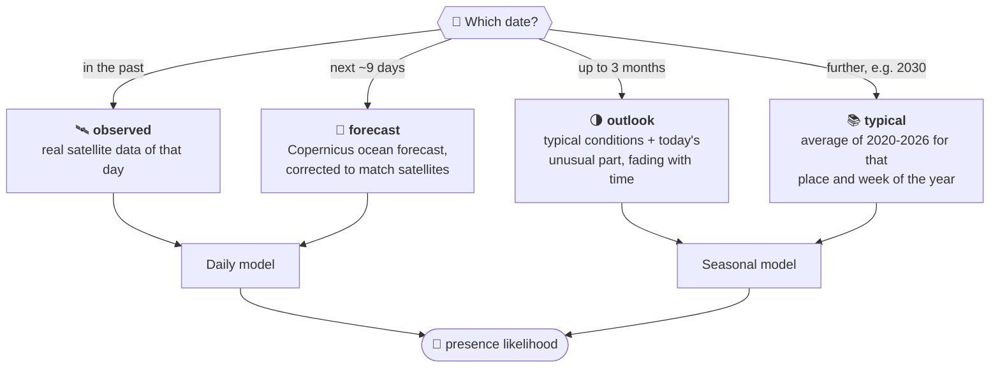
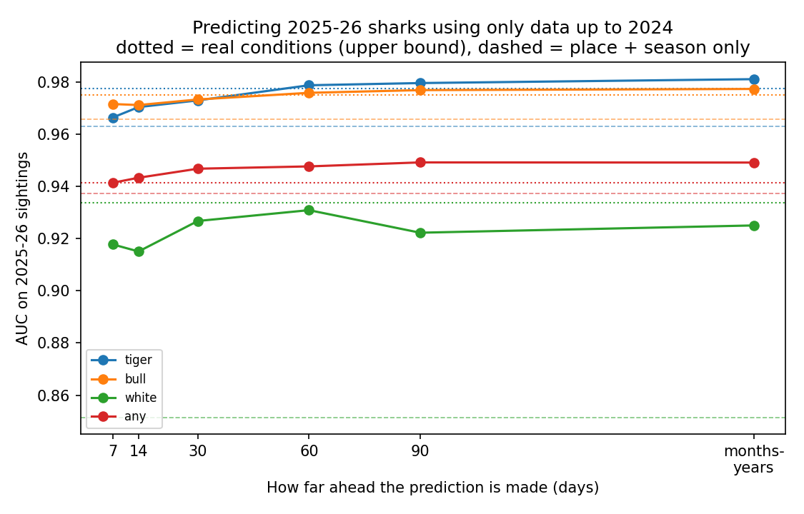
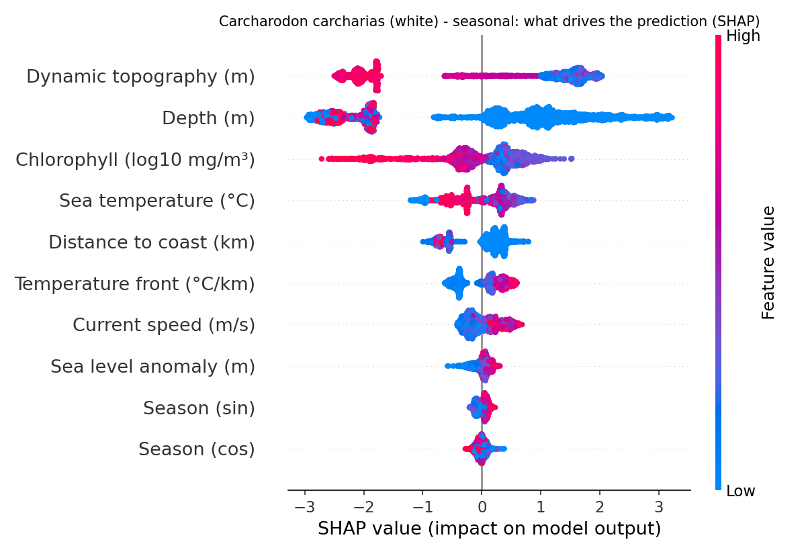

<div align="center">

# 🦈 Sharko

### Predicting where sharks will be around Australia, from space

*Satellite ocean data + 29,000 real shark sightings + machine learning → shark presence for any place and any date*

[](https://sharko-omega.vercel.app/)


[**Try it**](#-try-it-now) · [**How it works**](#-how-it-works) · [**Results**](#-results) · [**Run it**](#-run-it-yourself) · [**Repo map**](#-repository-map)

<br/>



<sub>Predicted habitat in January and July 2030 made by the Sharko models. White sharks move up the NSW coast in winter; tiger and bull sharks stay in warm northern and eastern waters.</sub>

</div>

---

## 🎯 Try it now

**[Open the live map →](https://sharko-omega.vercel.app/)** Pick a date (past or future) and a species to see where sharks are likely to be.

Some real answers from the model:

| Question | Answer |
|---|---|
| Sharks off **Sydney** on 15 Jan 2030? | 🟢 **87%** likely (bull 92%, great white 77%, tiger 2%) |
| Sharks off **Cairns** on 1 Jul 2031? | 🟢 **74%** likely |
| Sharks off **Hobart** on 20 Feb 2030? | 🟢 **93%** likely |
| Sharks in the middle of the desert? | 🚫 refused: *no ocean here* |

Ask your own question:
```bash
python ml/predictor.py -33.9 151.3 2030-01-15      # latitude  longitude  date
```

---

## 🧠 How it works



### What goes in, what comes out

<table>
<tr><th>📥 Input</th><th>📤 Output</th></tr>
<tr valign="top"><td>

A **position** and a **date**.<br/>The model then looks at 10 conditions there:

| | Condition |
|---|---|
| 🌡️ | Sea temperature |
| 🌀 | Temperature fronts |
| 🌿 | Chlorophyll (plankton) |
| 🌊 | Sea level anomaly · sea height |
| ➡️ | Current speed |
| ⬇️ | Depth |
| 🏖️ | Distance to coast |
| 📅 | Season |

</td><td>

For **tiger, bull, great white** and **any shark**:

- a **presence likelihood** from 0 to 1
- **likely habitat**: yes / no
- a **range** for far-future dates (cooler vs warmer year)
- the ocean conditions it used

The API also turns the whole-Australia grid into **map polygons** (GeoJSON).

</td></tr>
</table>

<details>
<summary><b>📄 Example: full answer for one position</b></summary>

```bash
python ml/predictor.py -33.9 151.3 2030-01-15
```
```json
{
  "position": {"lat": -33.9, "lon": 151.3},
  "date": "2030-01-15",
  "mode": "typical",
  "confidence": "medium - typical conditions for this time of year; cannot know if that year will be unusually warm or cool",
  "conditions_source": "typical conditions for this place and week (2020-2026)",
  "ocean_conditions": {
    "sea_temperature_c": 23.0, "temperature_front_c_per_km": 0.0414, "chlorophyll_mg_m3": 0.21,
    "sea_level_anomaly_m": 0.017, "current_speed_m_s": 0.223, "depth_m": 16.0, "distance_to_coast_km": 1.6
  },
  "sharks": {
    "Any shark":         {"presence_likelihood": 0.867, "likely_habitat": true,  "range": [0.866, 0.870]},
    "Bull Shark":        {"presence_likelihood": 0.920, "likely_habitat": true,  "range": [0.911, 0.920]},
    "Great White Shark": {"presence_likelihood": 0.773, "likely_habitat": true,  "range": [0.773, 0.780]},
    "Tiger Shark":       {"presence_likelihood": 0.021, "likely_habitat": false, "range": [0.021, 0.024]}
  }
}
```
<sub>Shortened: each species also reports its threshold, model and whether the position is inside its known range.</sub>
</details>

### 🔮 Predicting a future date

Nobody has measured the ocean of a future day, so Sharko estimates it. The method depends on how far ahead the date is:



<details>
<summary><b>Why this works, with a real example</b></summary>

Mid-January off Sydney, averaged from the real satellite data:

| Year | Sea temp | Chlorophyll |
|---|---|---|
| 2020 | 22.5 °C | 0.40 |
| 2022 | 23.1 °C | 0.29 |
| 2024 | 23.5 °C | 0.22 |
| 2026 | 22.5 °C | 0.31 |
| **Typical → used for 2030** | **23.0 °C ± 0.5** | **0.30** |

Sea temperature at a given place and time of year changes only about ±0.5 °C from year to year, so the typical value is a good estimate years ahead. Eddies and storms can't be predicted that far, which is why far-future answers come with a cooler/warmer-year range.

Two safety rules:
- a species is only predicted within **500 km of where it has actually been recorded** (no white sharks in the tropics just because the water looks similar);
- positions on land or outside Australian waters (110-160°E, 9-46°S) are refused.
</details>

---

## 📊 Results

### Tested on regions the models never saw

*Whole 2°×2° areas of coast are hidden during training, then predicted.* AUC: 0.5 = coin flip, 1.0 = perfect.

| Species | Daily model | Long-range model | |
|---|:---:|:---:|---|
| 🟠 Bull shark | **0.93** | **0.94** | `█████████▍` |
| 🔴 All sharks | **0.90** | **0.90** | `█████████ ` |
| 🔵 Tiger shark | **0.89** | **0.88** | `████████▉ ` |
| 🟢 Great white | **0.81** | **0.82** | `████████▏ ` |

### Predicting the future (backtest)

*Trained on 2020-2024 only, then asked to predict the real 2025-2026 sightings, like predicting 2030 today.*

| Species | AUC | Real sightings caught |
|---|:---:|:---:|
| 🔵 Tiger | 0.98 | 99% |
| 🟠 Bull | 0.98 | 100% |
| 🟢 Great white | 0.93 | 91% |
| 🔴 All sharks | 0.95 | 95% |

<details>
<summary><b>📈 Accuracy vs. how far ahead (chart)</b></summary>
<br/>


Predicting months or years ahead with typical conditions is almost as good as knowing the real ocean (dotted lines). For great whites, ocean data adds the most over place + season alone (dashed line): 0.93 vs 0.85, and false alarms drop from 43% to 22%.

The backtest sightings come from places already seen in training, so the region test above is the more cautious measure.
</details>

<details>
<summary><b>🔍 What drives the predictions (great white shark)</b></summary>
<br/>


Each dot is one place and day. Red = high value, blue = low. Dots to the right push the prediction up. Great whites favour lower sea height (cooler, southern water), shallow water close to the coast and temperature fronts, and avoid very plankton-rich (murky) water.
</details>

<details>
<summary><b>🧪 All reports</b></summary>

| Report | What's in it |
|---|---|
| [Model comparison](ml/models/report.md) | GLM vs Random Forest vs tuned LightGBM for every species |
| [Long-range models](ml/models/seasonal/report.md) | the same, trained on typical conditions |
| [Backtest](ml/models/backtest_report.md) | future prediction at 7, 14, 30, 60, 90 days and months/years ahead |
| [Model tests](ml/models/test_report.md) | integrity, biology and unseen-region checks |
| [Pipeline tests](ml/models/pipeline_test_report.md) | 28/28 end-to-end checks passing |
| [Dataset report](ml/data/dataset_report.txt) | sizes, ranges, balance, per-species stats |
</details>

---

## 🚀 Run it yourself

<details open>
<summary><b>🐍 Ask the model directly</b></summary>

```bash
cd ml
pip install -r requirements.txt
python predictor.py -33.9 151.3 2030-01-15
```
</details>

<details>
<summary><b>⚡ Run the API locally</b></summary>

```bash
cd api
pip install -r requirements.txt
uvicorn app:app --port 8000
```
Open http://localhost:8000/docs. The API reads the models straight from `ml/`. See [api/README.md](api/README.md).
</details>

<details>
<summary><b>🌐 Run the website locally</b></summary>

```bash
cd frontend
npm install
cp .env.example .env      # add your Mapbox public token
npm run dev               # http://localhost:5173
```
See [frontend/README.md](frontend/README.md).
</details>

<details>
<summary><b>🔁 Rebuild everything from raw data</b></summary>

The numbered scripts in [`ml/`](ml/README.md) download the data, build the datasets, train and test the models:

| Step | Script | |
|---|---|---|
| 1-4 | `01`-`04` | shark records from OBIS, GBIF, QLD → merge + clean |
| 5-6 | `05`, `06` | daily satellite ocean data (~20 GB, free Copernicus account) + depth |
| 7-8 | `07`, `08` | training dataset + checks |
| 9-11 | `09`-`11` | train, map, test the daily models |
| 12-14 | `12`-`14` | climatology, long-range models, future backtest |
| 15 | `15` | 9-day ocean forecast (run daily) |
| 16 | `16` | end-to-end pipeline test |
</details>

---

## 🗂️ Repository map

```
Sharko-Australia/
├── 📁 ml/                  Python: data → models → predictor
│   ├── 01…16_*.py          numbered pipeline steps
│   ├── predictor.py        predict(lat, lon, date) for any date
│   ├── data/               shark records, datasets, climatology, forecast, depth
│   ├── models/             trained models, seasonal/ models, plots, reports
│   └── maps/               example habitat maps
├── 📁 api/                 FastAPI backend → Hugging Face Space
├── 📁 frontend/            React + Vite website → Vercel
└── 📁 docs/                images for this README
```

---

## 🛰️ Data sources

| | Data | Source |
|---|---|---|
| 🦈 | Shark sightings, tagging, camera surveys | [OBIS](https://obis.org) · [GBIF / Atlas of Living Australia](https://www.gbif.org) |
| 🎣 | Shark catches at Queensland beaches | [Queensland Shark Control Program](https://www.data.qld.gov.au) |
| 🛰️ | Sea temperature, sea level, currents, chlorophyll, forecasts | [Copernicus Marine Service](https://marine.copernicus.eu) |
| ⛰️ | Seafloor depth | [NOAA ETOPO](https://www.ncei.noaa.gov/products/etopo-global-relief-model) |

## ⚠️ Limitations

- **East-coast bias:** 86% of sightings come from the east coast, where most divers, tags and drumlines are. Predictions for Western Australia and the north are less certain.
- **Far future = typical year:** beyond ~10 days nobody can forecast eddies or storms, so long-range answers describe where sharks *usually* are at that time of year.
- **Likelihood, not certainty:** the score says how well the conditions match where the species is usually found, not that a shark is definitely there.

<details>
<summary><b>What's not in this repository</b></summary>

- the daily satellite archive (~20 GB): recreate with `ml/05_get_ocean_data.py`
- `api/au/`: a deployment copy of the ML files, made with `api/prepare_deploy.py`
- secrets (`.env`): see each folder's `.env.example`
</details>

---

<div align="center">

Data: OBIS · GBIF · Queensland Government · Copernicus Marine · NOAA

**[🌊 Visit Sharko](https://sharko-omega.vercel.app/)**

</div>
